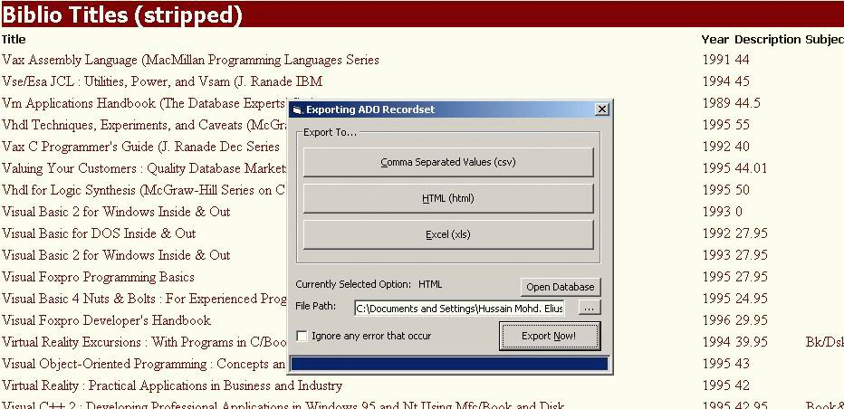

<div align="center">

## \[HME\] ADO Recordset Export Class \(CSV, HTML, Excel\)


</div>

### Description

[Updated 27/2/05] Make your recordset universal! Use this class to export ADO recordsets into the industrial standered [csv], commercial standered [html] and the power user standered [Excel]. This is an updated version of my previous work, now complete Events, Properties, Documentation and even more options! Fuly optimized and commented. All bugs fixed. A must have for any database devoloper and a must add to any code library!
 
### More Info
 


<span>             |<span>
---                |---
**Submitted On**   |2005-02-26 20:37:20
**By**             |[HME\_Elvis](https://github.com/Planet-Source-Code/PSCIndex/blob/master/ByAuthor/hme-elvis.md)
**Level**          |Intermediate
**User Rating**    |4.6 (172 globes from 37 users)
**Compatibility**  |VB 5\.0, VB 6\.0, VBA MS Access, VBA MS Excel
**Category**       |[Databases/ Data Access/ DAO/ ADO](https://github.com/Planet-Source-Code/PSCIndex/blob/master/ByCategory/databases-data-access-dao-ado__1-6.md)
**World**          |[Visual Basic](https://github.com/Planet-Source-Code/PSCIndex/blob/master/ByWorld/visual-basic.md)
**Archive File**   |[\[HME\]\_ADO\_1858212272005\.zip](https://github.com/Planet-Source-Code/hme-elvis-hme-ado-recordset-export-class-csv-html-excel__1-58842/archive/master.zip)

### API Declarations

```
'API used for custom DoEvents Function
Private Declare Function GetQueueStatus Lib "user32" (ByVal qsFlags As Long) As Long
```


